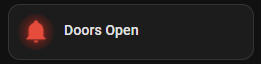
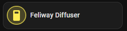
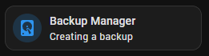
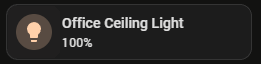
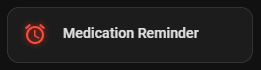
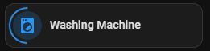
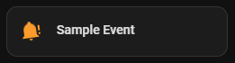
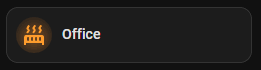
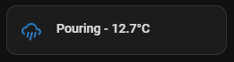
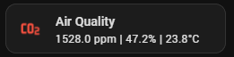

# ha-animated-icons
A collection of animated Mushroom cards for Home Assistant dashboards. Each card uses standard Mushroom cards with `card_mod` and CSS animations to create purposeful, informative animations that enhance your dashboard without being overly flashy or performance-heavy.

> 📺 These cards were created as part of a [Byte of Geek](https://www.youtube.com/@ByteOfGeek) YouTube video. Check out the video for a full walkthrough of each card and how to configure them.

---

## Prerequisites

All cards require the following HACS integrations:

- [Mushroom Cards](https://github.com/piitaya/lovelace-mushroom)
- [card-mod](https://github.com/thomasloven/lovelace-card-mod)

Cards 06 and 07 also require additional configuration in `configuration.yaml` - see the individual card sections below.

---

## The Cards

| # | Card | Animation | Use Case |
|---|------|-----------|----------|
| 01 | [Open Door Alert](#01-open-door-alert) |  | Door/window sensors open |
| 02 | [Switch On Pulsing](#02-switch-on-pulsing) |  | Switch active state |
| 03 | [Process Running](#03-process-running) |  | Backup or running process |
| 04 | [Glowing Light](#04-glowing-light) |  | Light entities |
| 05 | [Reminder Alarm](#05-reminder-alarm) |  | Timer alerts |
| 06 | [Appliance Power Draw](#06-appliance-power-draw) |  | Smart plug appliances |
| 07 | [Upcoming Event](#07-upcoming-event) |  | Calendar events |
| 08 | [Heating Running](#08-heating-running) |  | Climate/heating entities |
| 09 | [Minimal Weather](#09-minimal-weather) |  | Weather entities |
| 10 | [Air Quality Alert](#10-air-quality-alert) |  | CO2/air quality sensors |

---

## 01 Open Door Alert

📁 [card.yaml](cards/card-01-open-door-alert/card.yaml) · [example.yaml](cards/card-01-open-door-alert/example.yaml)

Displays a green door closed icon when all doors are shut. When one or more doors are open, switches to a pulsing red glowing bell icon.

**Card type:** `custom:mushroom-template-card`

**What to change:**
- `[SENSOR.ENTITY_NAME]` - replace with your door count sensor entity ID. This should be a template sensor that returns the number of open doors or windows. See the example for a group based helper that counts open binary sensors.

---

## 02 Switch On Pulsing

📁 [card.yaml](cards/card-02-switch-on-pulsing/card.yaml) · [example.yaml](cards/card-02-switch-on-pulsing/example.yaml)

Shows an expanding ring that pulses outward from the icon when a switch is active. The ring colour automatically matches the icon colour.

**Card type:** `custom:mushroom-entity-card`

**What to change:**
- `[SWITCH.ENTITY_NAME]` - replace with your switch entity ID
- `icon_color` - set to any colour you prefer, the ring will match

---

## 03 Process Running

📁 [card.yaml](cards/card-03-process-running/card.yaml) · [example.yaml](cards/card-03-process-running/example.yaml)

Shows an animated line sweeping across the bottom of the card when a process is active. Returns to a standard static card when the process completes. The example uses the Home Assistant backup manager.

**Card type:** `custom:mushroom-entity-card`

**What to change:**
- `[SENSOR.ENTITY_NAME]` - replace with your sensor entity ID
- `create_backup` - replace with the state your entity shows when the process is active. Check Developer Tools → States to find the correct value.
- `icon` and `name` - update to suit your use case

---

## 04 Glowing Light

📁 [card.yaml](cards/card-04-glowing-light/card.yaml) · [example.yaml](cards/card-04-glowing-light/example.yaml)

A brightness and colour aware glow that pulses around the icon. At low brightness the glow is subtle; at full brightness it is significantly more intense. Automatically uses the actual light colour if available.

**Card type:** `custom:mushroom-light-card`

**What to change:**
- `[LIGHT.ENTITY_NAME]` - replace with your light entity ID

---

## 05 Reminder Alarm

📁 [card.yaml](cards/card-05-reminder-alarm/card.yaml) · [example.yaml](cards/card-05-reminder-alarm/example.yaml)

Displays a static alarm icon while a timer is counting down. When the timer reaches zero the icon turns red and swings side to side with a glowing red effect, like a ringing alarm bell.

**Card type:** `custom:mushroom-template-card`

**What to change:**
- `[TIMER.ENTITY_NAME]` - replace with your timer entity ID
- `primary` - update to the name of your timer or reminder

> **Note:** HA timers use `idle` as the state both before they have been started and after they finish. The animation triggers on `idle` which means it will also show on first load before the timer has been used. If this is an issue, consider using an automation with an `input_boolean` to track the finished state more precisely.

---

## 06 Appliance Power Draw

📁 [card.yaml](cards/card-06-appliance-power-draw/card.yaml) · [example.yaml](cards/card-06-appliance-power-draw/example.yaml) · [sensor.yaml](cards/card-06-appliance-power-draw/sensor.yaml)

A spinning arc around the icon that speeds up or slows down in real time based on the power draw of an appliance connected to a smart plug.

**Card type:** `custom:mushroom-entity-card`

**Requires:** An additional trigger based template sensor in `configuration.yaml`. See [sensor.yaml](cards/card-06-appliance-power-draw/sensor.yaml) for the configuration and restart Home Assistant after adding it.

**What to change in sensor.yaml:**
- `[SENSOR.ENTITY_NAME]` - replace with the power sensor entity of your smart plug
- The wattage thresholds - adjust to match your appliance. Run a full cycle and observe the power draw in Developer Tools → States to find the right values.

**What to change in card.yaml:**
- `[SWITCH.ENTITY_NAME]` - replace with your smart plug switch entity ID
- `name` and `icon` - update to suit your appliance

---

## 07 Upcoming Event

📁 [card.yaml](cards/card-07-upcoming-event/card.yaml) · [example.yaml](cards/card-07-upcoming-event/example.yaml) · [sensor.yaml](cards/card-07-upcoming-event/sensor.yaml)

Displays a static calendar icon when no event is active. When a calendar event is in progress, the icon rocks side to side and alternates between a calendar and a bell-alert icon. The card primary text updates to show the event name.

**Card type:** `custom:mushroom-template-card`

**Requires:** An additional time based template sensor in `configuration.yaml`. See [sensor.yaml](cards/card-07-upcoming-event/sensor.yaml) for the configuration and restart Home Assistant after adding it.

**What to change in card.yaml:**
- `[CALENDAR.ENTITY_NAME]` - replace with your calendar entity ID

> **Note:** The calendar entity state is `on` only when an event is currently in progress, not when one is upcoming. The card will show the static calendar icon until the event start time is reached.

---

## 08 Heating Running

📁 [card.yaml](cards/card-08-heating-running/card.yaml) · [example.yaml](cards/card-08-heating-running/example.yaml)

Alternates between two radiator icons with a pulsing orange glow when heating is active. Returns to a static grey radiator-off icon when the heating stops.

**Card type:** `custom:mushroom-template-card`

**What to change:**
- `[CLIMATE.ENTITY_NAME]` - replace with your climate entity ID
- `primary` - update to the name of the room
- `is_heating` - if your climate integration uses a different attribute to indicate heating is active, replace this with the correct attribute name. Check Developer Tools → States → your climate entity attributes to find it.

---

## 09 Minimal Weather

📁 [card.yaml](cards/card-09-minimal-weather/card.yaml) · [example.yaml](cards/card-09-minimal-weather/example.yaml)

A clean weather card showing an animated icon and current temperature. The animation and colour change based on the current weather condition - sunny icons spin, rain icons slide, clouds pulse, and wind icons shake.

**Card type:** `custom:mushroom-template-card`

**What to change:**
- `[WEATHER.ENTITY_NAME]` - replace with your weather entity ID. This appears in both the `entity` field and inside the `card_mod` style block.
- The icon mapper and colour conditions can be extended if your weather provider returns additional condition states not listed.

---

## 10 Air Quality Alert

📁 [card.yaml](cards/card-10-air-quality-alert/card.yaml) · [example.yaml](cards/card-10-air-quality-alert/example.yaml)

Displays a CO2 icon that changes colour and pulse speed based on the current reading. Green and static at safe levels, amber with a slow pulse at moderate levels, red with a faster pulse at high levels.

**Card type:** `custom:mushroom-template-card`

**What to change:**
- `[SENSOR.AIR_QUALITY_MONITOR_NAME]` - replace with your CO2 sensor entity ID
- `[SENSOR.AIR_QUALITY_MONITOR_CARBON_DIOXIDE]`, `[SENSOR.AIR_QUALITY_MONITOR_HUMIDITY]`, `[SENSOR.AIR_QUALITY_MONITOR_TEMPERATURE]` - replace with the relevant sensor entity IDs for your device. If your sensor does not provide humidity or temperature, remove those values from the `secondary` field.
- The ppm thresholds (default: below 800 safe, 800–1200 moderate, above 1200 high) - adjust to match your own acceptable ranges if needed.

---

## Notes

- All cards use standard Mushroom card types - no additional custom card components are required beyond Mushroom and card-mod.
- Animations are designed to be lightweight and should not impact dashboard rendering performance.
- The visual editor in Home Assistant may show warnings for some cards due to the use of `card_mod` and template fields. This is expected and the cards will still function correctly - use the YAML editor to make changes.
- Cards 06 and 07 require entries in `configuration.yaml` and a restart of Home Assistant before they will function correctly.

---

## Credits

Created by [Simon @ Byte of Geek](https://www.byteofgeek.com) - Home Assistant and Smart Home Technology content.